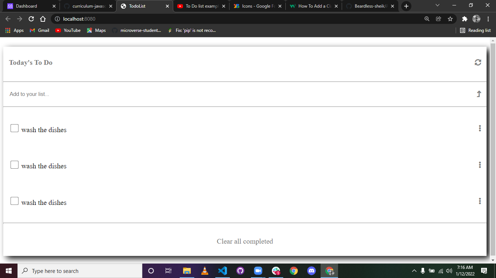

# TodoList
# Todolist
> this is the desktop version of mytododlist.



this desktop version of my tododlist contains also mobile version 

## Built With


- Major languages : Html , css and javascript

- Technologies used :linters,git ,webpack and github


To get a local copy up and running follow these simple example steps.

```
-clone the repo in a folder in  your local machine using **git clone command**
-pull the files from origin/master using **git pull command**
-run the index.html in any browser to get output of the project
```

[Live Demo](https://mugishasam123.github.io/todoList-Javascript/)


## Authors

👤 **Author**

- GitHub: [@githubhandle](https://github.com/mugishasam123)
- Twitter: [@twitterhandle](https://twitter.com/mugishasamuel42/)
- LinkedIn: [LinkedIn](https://www.linkedin.com/in/mugisha-samuel-55a905208/)


## 🤝 Contributing

Contributions, issues, and feature requests are welcome!

Feel free to check the [issues page](../../issues/).

## Show your support

Give a ⭐️ if you like this project!

## Acknowledgments

- Hat tip to anyone whose code was used
- Inspiration
- etc

## 📝 License

This project is [MIT](./MIT.md) licensed.